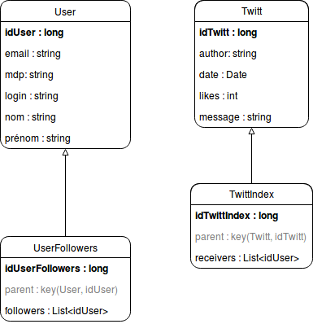

# Tiny Twitt

## Intro

## Backend
La partie backend du projet et les classes java qui la composent se situent dans le répertoire [/src/projetwcd](https://github.com/PierreCaillaudM/tinytwitt/tree/master/src/projetwcd). Il contient deux beans, [Utilisateur.java](https://github.com/PierreCaillaudM/tinytwitt/tree/master/src/projetwcd/beans/Utilisateur.java) et [Twitt.java](https://github.com/PierreCaillaudM/tinytwitt/tree/master/src/projetwcd/beans/Twitt.java), et notre endpoint [TinytwittEndpoint.java](https://github.com/PierreCaillaudM/tinytwitt/tree/master/src/projetwcd/TinytwittEndpoint.java) contenant l'ensemble des fonctions de notre API.

#### Structure chosie

Pour ce projet, il nous faut pouvoir représenter au moins deux entités: une entité <i>User</i> contenant les informations relative à l'utilisateur inscrit, et une entité <i>Twitt</i> contenant les informations relatives à un twitt posté par un utilisateur.

L'entité <i>UserFollowers</i> quant à elle, à pour rôle de stocker l'ensemble des idUtilisateur des followers de son User parent. Le choix d'une telle structure permet d'éviter d'avoir à sérialiser/déserialiser la liste des utilisateur à chaque fois que l'on souhaite récupérer un utilisateur dans le datastore, limitant ainsi le temps et la bande passante requis pour récupérer un utilisateur. Le même principe s'applique aux entités <i>Twitt</i> et <i>TwittIndex</i> dont le fonctionnement est explicité dans la prochaine section.

#### Récupérer la timeline d'un utilisateur

Nous n’expliciterons que le fonctionnement de la fonction getTimelineOf(loginUser) dont l'implémentation est visible dans [ce fichier](https://github.com/PierreCaillaudM/tinytwitt/tree/master/src/projetwcd/TinytwittEndpoint.java) (les autres fonctions présentant moins d'intérêt en comparaison).

La première partie consiste à récupérer l'id de l'utilisateur dont on souhaite récupérer la timeline et dont on a passé le login en paramètre. 
L'idée est, ensuite, d'aller récupérer l'ensemble des parent des TwittIndex dont la liste des receivers contient l'id de notre user (l.249-259). Ici l'emploi de setKeysOnly() (l.251) est donc capital pour éviter le problème évoqué dans la partie précédente. Une fois l'ensemble de ces clés récupérées, il suffit d'aller chercher l'ensemble des Twitts correspondant dans le datastore puis de les retourner sous forme de liste.

## Frontend
